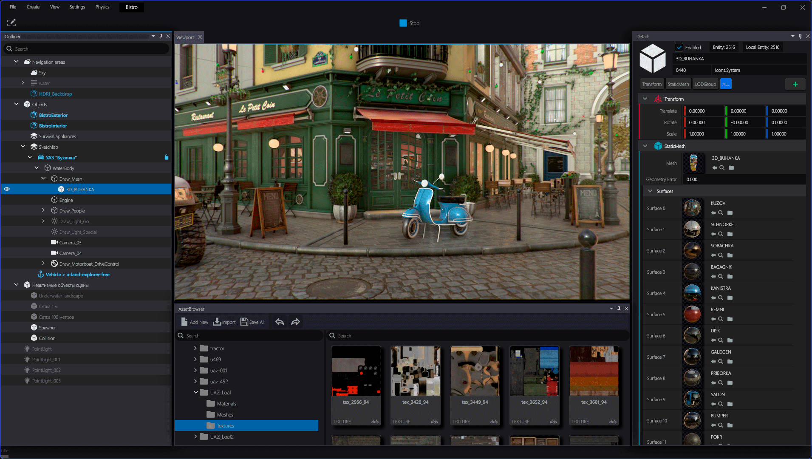

# MiracleEngineSDK
Miracle Engine — a real-time PBR engine for Linux, Windows and WebGL. Optimized for minimal size and peak WebGL performance.

[](https://github.com/mchudesnov/MiracleEngineSDK)
[](https://github.com/mchudesnov/MiracleEngineSDK)
[](https://github.com/mchudesnov/MiracleEngineSDK)

## Download

[Download Miracle Engine releases](https://github.com/mchudesnov/MiracleEngineSDK/releases) to access stable builds.
Release archives contain host-side tools that are required to generate assets.

Make sure you always use tools from the same release as the runtime library. This is particularly important for `miracle-c` (resource compiler).

If you'd rather build Miracle Engine yourself, please refer to our [build manual](/BUILDING.md).

## Documentation

- **Miracle Engine Guide**: An in-depth explanation of the architecture, graphics capabilities, and implementation details.
- **Materials**: The full reference documentation for the material system and shader graph.
- **API Reference**: Complete API documentation for C++ and JavaScript.

## Examples




## Features

### APIs
- Native C++ API for Windows and Linux
- JavaScript API for WebGL

### Backends
- DirrectX 12 for Windows
- OpenGL 4.1+ for Linux and Windows
- Vulkan 1.0 for Linux and Windows
- WebGL 2.0 for all modern browsers

### Rendering
- Clustered forward renderer
- Physically based rendering (PBR)
- Metallic workflow
- Image-based lighting
- Point lights, spot lights, and directional light shadows
- Cascaded shadows
- Screen-space reflections
- Global fog
- Dynamic resolution

### Post processing
- HDR bloom
- Depth of field
- Tone mapping (ACES, Filmic, etc.)
- Color grading
- TAA, FXAA, MSAA, SSAO

### Editor & Tools
- Integrated level editor
- Visual scripting support
- Asset management pipeline

## Rendering with Miracle Engine

### Native Linux and Windows

You must create an `Engine`, a `Renderer`, and a `SwapChain`. The `SwapChain` is created from a native window pointer:

```cpp
#include <MiracleEngine/Engine.h>

using namespace miracle;

Engine* engine = Engine::create();
SwapChain* swapChain = engine->createSwapChain(nativeWindow);
Renderer* renderer = engine->createRenderer();
```

To render a frame you must then create a `View`, a `Scene`, and a `Camera`:

```cpp
Camera* camera = engine->createCamera(EntityManager::get().create());
View* view = engine->createView();
Scene* scene = engine->createScene();

view->setCamera(camera);
view->setScene(scene);
```

To render, simply pass the `View` to the `Renderer`:

```cpp
if (renderer->beginFrame(swapChain)) {
    renderer->render(view);
    renderer->endFrame();
}
```

### WebGL

Miracle Engine provides a JavaScript API that mirrors the native C++ API closely. You can use it to create interactive 3D experiences running in any modern browser.

```javascript
const engine = Miracle.Engine.create();
const canvas = document.getElementById('canvas');
const swapChain = engine.createSwapChain(canvas);
const renderer = engine.createRenderer();
// ... setup scene and camera
```

## Directory structure

This repository contains the core engine, supporting libraries, and tools.

- `engine`: Core Miracle Engine source code
  - `backend`: Rendering backends (Vulkan, OpenGL, WebGL)
- `tools`: Host tools (compilers, asset processors)
- `js`: JavaScript bindings for WebGL
- `samples`: Sample desktop and web applications
- `docs`: Documentation and guides
- `third_party`: External dependencies and assets

## License

Please see [LICENSE](/LICENSE).

## Disclaimer

This is an no open-source project developed by Miracle-Soft.
